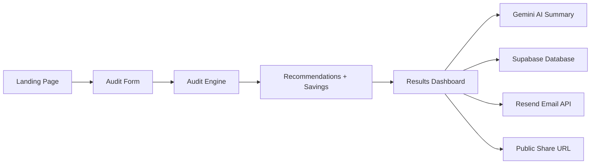

# Architecture

## Overview

SpendPilot is a lightweight SaaS MVP that helps users optimize AI software spending across tools like ChatGPT, Claude, Cursor, GitHub Copilot, and Gemini.

The project uses:

* Next.js 15
* TypeScript
* Supabase
* Google Gemini
* Resend

The architecture focuses on:

* simplicity,
* maintainability,
* deterministic business logic,
* fast iteration.

---

## System Architecture



---

## Folder Structure

```txt
src/
├── app/
├── components/
├── lib/
└── tests/
```

* `app/` → routes and API handlers
* `components/` → reusable UI components
* `lib/` → business logic and utilities
* `tests/` → Vitest test files

---

## Audit Engine

The audit engine uses deterministic rules-based logic.

Responsibilities:

* pricing comparisons,
* downgrade detection,
* savings calculations,
* recommendation generation.

Main files:

* `src/lib/audit.ts`
* `src/lib/pricing.ts`

No AI is used for financial calculations.

---

## API Routes

### `/api/summary`

Generates Gemini AI summaries.

### `/api/leads`

Stores lead data and sends emails using Resend.

---

## Database

Supabase stores:

* audit reports,
* lead information.

Main tables:

* `audits`
* `leads`

---

## State Management

State is managed using:

* React hooks,
* local component state,
* localStorage persistence.

Redux and complex global state libraries were intentionally avoided.

---

## CI/CD

GitHub Actions is used for:

* lint checks,
* tests,
* production build validation.

Deployment is handled using Vercel.

---

## Design Decisions

The project intentionally avoids:

* authentication,
* complex backend systems,
* overengineering,
* unnecessary abstractions.

The focus was building a realistic, maintainable SaaS MVP within a limited timeline.
